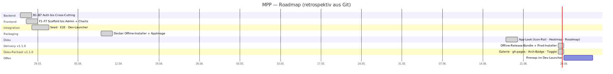

# Arbeitspakete & Roadmap

Die Arbeitspakete (APs) wurden **retrospektiv aus der Git-Historie** rekonstruiert
(feat-Commits + Changelog-Phasen, vgl. `CHANGELOG.md`). Backend und Frontend folgen
jeweils sieben Phasen, danach Integration und Auslieferung.

## AP-Überblick

Pfeil-Semantik: `-->` Reihenfolge · `==>` Schlüsselkante · `-.->` lose/optionale Abhängigkeit.
Status: ■ erledigt · ■ in Arbeit · ■ geplant.

## Roadmap (Gantt)

Zeitachse aus den echten Commit-Datumsbereichen (Bulk-Entwicklung 26.–28.03.2026,
Integration und Packaging bis April, Doku-App-Look im Juni).

## Offene Arbeitspakete

Quelle: `todos.md` (Repo-Root).

- **Offline-Demo-Installscript** — Installationshilfe/Script für eine vollständige
  Offline-Demo-Installation (über das vorhandene Docker-Setup + AppImage hinaus).
- **Prereqs im Dev-Launcher** — Prerequisites sammeln und einen Prereqs-Eintrag in
  den Dev-Launcher (`scripts/mpp.sh`) aufnehmen.
